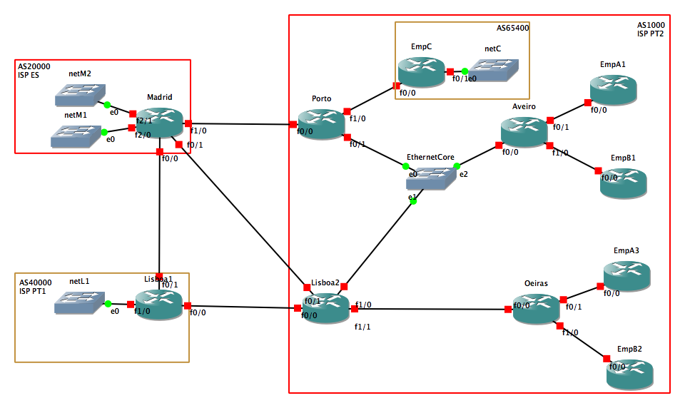

# advanced-network-arch
Planeamento e construção de uma rede avançada.

# BGP relations
##External BGP
####remote-asMadrid
Lisboa1, Lisboa2, Porto

## Internal BGP
#### remote-as, next-hop-self, update-source lp0
Porto, Lisboa2, Aveiro, Oeiras

## Private AS
#### remove-private-as
EmpC (definido em Porto)

# network topology
